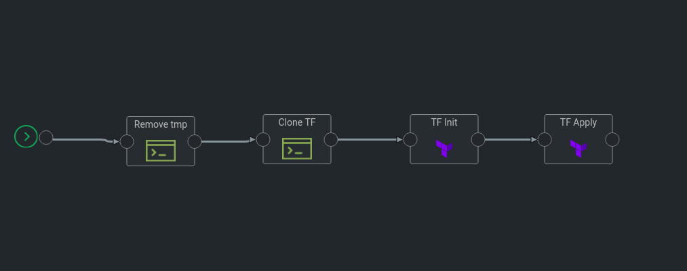

## AWS ACM pipeline
This template can be used to create AWS Certificate Manager(ACM). This template uses terraform module to create acm.

## Prerequisites
1. User should have the AWS credentials `Access_Key` and `Secret_Key` already stored in Kaholo's Vault. 
2. The domain_name should be already registered and available in public hosted zone in AWS Route53.

## Pipeline Steps
1. Remove any existing directory.
2. Clone the git repository which holds terraform modules.
3. Initiate terraform
4. Apply terraform.

### Executing the pipeline
1. Go to Pipelines in Kaholo dashboard.
2. Click on **Create** and select **Import Pipeline**
3. Give a name to the piepline, select the Project and upload the template which is available in this repo(**aws_acm_creation.json**).
4. Before executing, Click on **TF Apply** action and add apporpriate values to the function **getAWSCredentials()**
    *Example:* getAWSCredentials(domain_name, aws_vault_access_key, aws_vault_secret_key)
             - `domain_name`: domain_name that is registered in the AWS Route53
             - `aws_vault_access_key`: AWS Access Key which is available in the Kaholo's Vault.
             - `aws_vault_secret_key`: AWS Secret Key which is available in the Kaholo's Vault.
5. Save the template and click on **Execute**.
6. Check the progress of the execution in *Execution Results* section.

### Plugins used
1. CommandLine
2. Terraform-CLI

## Terraform Module
  The terraform module to create the AWS ACM is available in this [GitHub Repository](https://github.com/Yukesh4791/kaholo_templates/tree/feat/acm/terraform/acm).

## Author
* Yukesh H (https://github.com/Yukesh4791)

