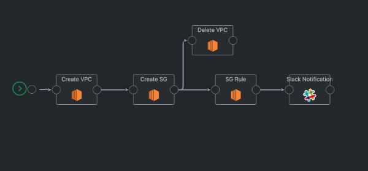

# AWS VPC SecurityGroup Pipeline

This template will create a new VPC and Security Group with specific Rules in Security Group on AWS.

 # Triggers

 This template is manually triggered

 # Prerequisites

1) AWS account with **aws_access_key_id** , **aws_secret_access_key**
2) Slack User token to send message to Channel

# Pipeline Steps

1) Create VPC - Create a new VPC
2) Create SG - Create Security Group
3) Delete VPC - Delete VPC created in Create VPC if the Create SG fails
4) Add SG Rules - Add Rules to Security Group added in Create SG step
5) Slack Notification - Send Slack message with newly created VPC and Security Group Id details

### Configuration variables

* **env**: <Environment for i.e Dev/ Prod>
* **cidr_block**: <CIDR block for VPC>
* **region**: <AWS Region>
* **sg_name**: kaholo

# Plugins
EC2 and Slack

# Pipeline Design

