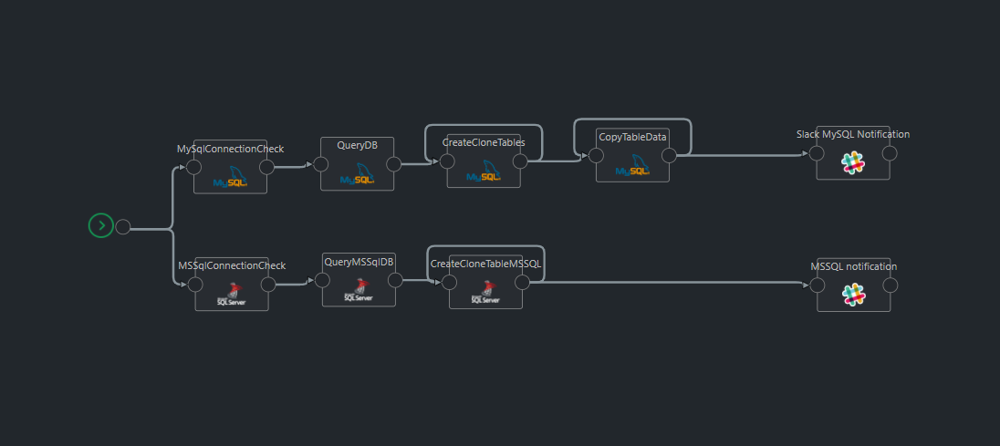

# Clone Database Tables

Thie Template is use for Clone database tables in same database.


## Cloning Database Tables

This template is help to clone the Database Tables in the same database. Template is customizable for MySQL and MSSQL database, This template first check connection and then check tables if it exist then it will create replica of table in the same database.




### Configuration variables

* **serverType**: Server Type ('MySql' or 'MsSQL').
* **server**: IP address or Server name of database server.
* **port**: Port number of database server.
* **database**: Database name.
* **userId**: Userid to access database server.
* **password**: Password to access database server.
* **cloneTableNames**: Table/s name that need to clone.
* **clonePerfix**: Prefix that need to add on Clone Table.
* **slackWebhookURL**: Slack Incomming webhook url.

Example:

```javascript
{
   "serverType": "MySql|MsSQL",
    "server": "123.123.0.123",
    "port": "80",
    "database": "db1",
    "userId": "sa",
    "password": "Sa@123",
    "cloneTableNames": [
        "table1",
        "table2"
    ],
    "clonePerfix": "Clone_",
    "slackWebhookURL":"htts://slack.test.com"
}
```


