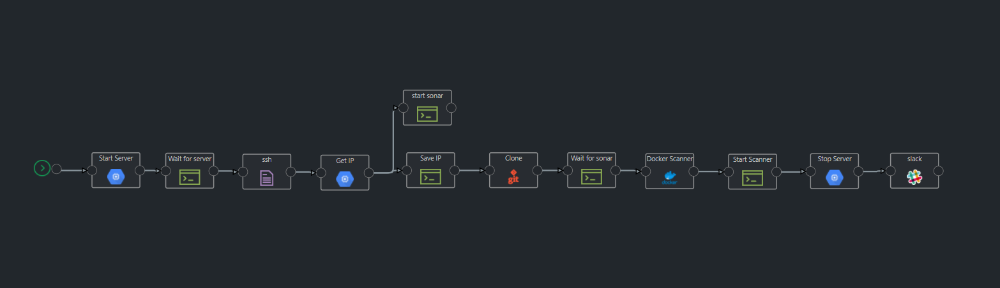

# On Demand Sonarqube Scanning

This pipeline template will enable user to run a sonar-scanning on a pre-configured sonarqube server on GCP. Server is stopped after the scan and started on the trigger.

 # Triggers

Configured to run on as a manual trigger.

 # Prerequisites

1) Create a VM on GCP and configure sonarqube server using docker https://docs.sonarqube.org/latest/setup/get-started-2-minutes/

# Pipeline Steps

Below are the different steps in this pipeline. The pipeline is mix of parallel and sequential steps.

1) Start Server - Starts the configured sonarqube server
2) Get IP - Get the external IP of the server
3) Start Sonar docker container using remote command execution
4) GIT Clone
5) Pull Docker scanner cli
6) Run the Sonar scan
7) Stop the server
8) Notify on Slack

# Plugins
 Google-Cloud-Compute-Engine,TextEditor, Command Line, Git, Docker, Slack

# Pipeline Design

